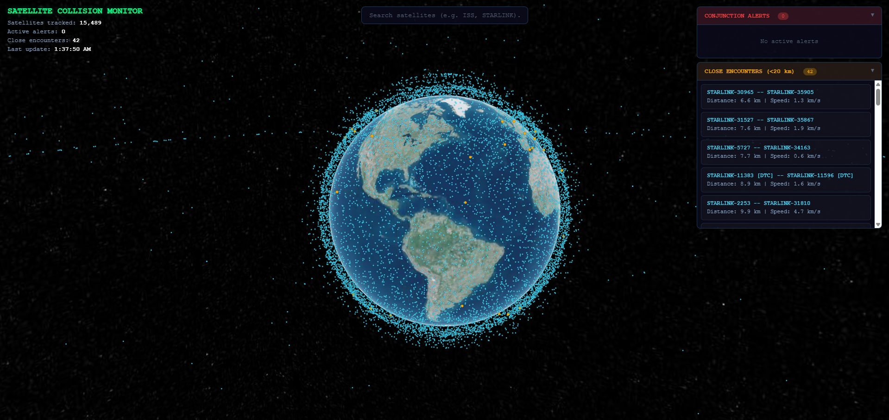

# Satellite Collision Monitor



Real-time satellite conjunction detection and collision risk assessment pipeline. Tracks ~15,000 active satellites, identifies close approaches using k-d tree spatial indexing, scores collision probability with a gradient-boosted model trained on real ESA conjunction data, and visualizes everything on an interactive 3D globe.

  

## Architecture

```
Celestrak ──► ingester.py ──► Kafka ──► propagator.py ──► Redis ──► detector.py ──► Dashboard
               (TLE fetch)     (tle-updates)  (SGP4 orbit prop)       (k-d tree +     (CesiumJS
                                                                       ML scoring)      3D globe)
```

**ingester.py** — Fetches Two-Line Element (TLE) data from Celestrak every 30 minutes and publishes to Kafka.

**propagator.py** — Consumes TLEs from Kafka, propagates orbits to current positions using SGP4, writes ECI coordinates to Redis. Re-propagates all satellites every 60 seconds.

**detector.py** — Reads satellite positions from Redis, runs k-d tree spatial search to find close pairs, filters co-orbiting and docked objects, scores candidates with an ML model, and stores alerts and close encounters back to Redis.

**dashboard/** — Flask backend + CesiumJS frontend. Displays all tracked satellites on a 3D globe with search, click-to-inspect, projected orbit rendering, conjunction alerts, and close encounter tracking.

## Notebooks

The research and model development is documented in three Jupyter notebooks:

| Notebook | Description |
|---|---|
| `01_explore_tle_data.ipynb` | TLE data fetching, SGP4 propagation, orbital visualization, brute-force conjunction search |
| `02_fast_conjunction_search.ipynb` | K-d tree spatial indexing, O(n log n) conjunction screening, false positive filtering, benchmarking |
| `03_ml_model_training.ipynb` | Collision risk model trained on [ESA Kelvins Collision Avoidance Challenge](https://kelvins.esa.int/collision-avoidance-challenge/) real CDM data (~13k events, 103 features) |

## Quick Start

### Prerequisites

- Python 3.10+
- Docker Desktop (with WSL integration if on Windows)
- [Cesium Ion](https://ion.cesium.com) access token (free)

### Setup

```bash
# Clone and create virtual environment
git clone https://github.com/mdox517/satellite-collision.git
cd satellite-collision
python3 -m venv venv
source venv/bin/activate

# Install dependencies
pip install sgp4 numpy pandas scipy scikit-learn requests confluent-kafka redis flask matplotlib

# Start infrastructure
docker compose up -d
```

### Add your Cesium Ion token

Open `dashboard/static/index.html` and replace the token in the `Cesium.Ion.defaultAccessToken` line with your own from [ion.cesium.com](https://ion.cesium.com).

### Run the pipeline

Start each service in its own terminal:

```bash
# Terminal 1 — Propagator (start first so it's listening)
source venv/bin/activate
python src/propagator.py

# Terminal 2 — Ingester (fetches TLEs and publishes to Kafka)
source venv/bin/activate
python src/ingester.py

# Terminal 3 — Detector (conjunction search + ML scoring)
source venv/bin/activate
python src/detector.py

# Terminal 4 — Dashboard
source venv/bin/activate
python dashboard/server.py
```

Open [http://localhost:8080](http://localhost:8080) in your browser.

### Run the notebooks

```bash
pip install ipykernel jupyter
python -m ipykernel install --user --name=satellite-collision --display-name "satellite-collision"
jupyter notebook notebooks/
```

## Dashboard Features

- **15,000+ satellites** rendered in real-time on a 3D globe
- **Search** — find any satellite by name or NORAD ID
- **Click to inspect** — select a satellite to see its info and projected orbit
- **Conjunction Alerts** — high-risk collision events (Pc > 10^-6)
- **Close Encounters** — satellite pairs within 20 km, filtered for co-orbiting objects
- **Collapsible panels** — collapse Close Encounters to hide orange markers from the globe

## Data Sources

- **TLE data:** [Celestrak](https://celestrak.org) (active satellites, space stations, Cosmos 2251 debris)
- **ML training data:** [ESA Kelvins Collision Avoidance Challenge](https://zenodo.org/records/4463683) (CC-BY 4.0) — real Conjunction Data Messages from ESA's Space Debris Office

## Tech Stack

| Component | Technology |
|---|---|
| Orbit propagation | SGP4 via [python-sgp4](https://github.com/brandon-rhodes/python-sgp4) |
| Spatial indexing | scipy KDTree |
| ML model | scikit-learn GradientBoostingRegressor |
| Message broker | Apache Kafka |
| State store | Redis |
| Backend | Flask |
| Frontend | CesiumJS |
| Infrastructure | Docker Compose |

## Configuration

All services are configurable via environment variables:

| Variable | Default | Description |
|---|---|---|
| `KAFKA_BROKER` | `localhost:9092` | Kafka bootstrap server |
| `REDIS_HOST` | `localhost` | Redis host |
| `REDIS_PORT` | `6379` | Redis port |
| `FETCH_INTERVAL_SEC` | `1800` | TLE fetch interval (seconds) |
| `REPROPAGATE_INTERVAL_SEC` | `60` | Orbit re-propagation interval |
| `SCAN_INTERVAL_SEC` | `60` | Detection cycle interval |
| `CLOSE_ENCOUNTER_KM` | `20` | Close encounter distance threshold |
| `ALERT_RISK_THRESHOLD` | `-6.0` | Log10(Pc) threshold for alerts |
| `DASHBOARD_PORT` | `8080` | Dashboard web server port |
